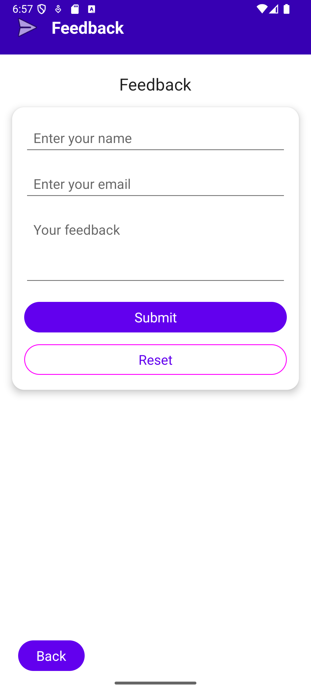
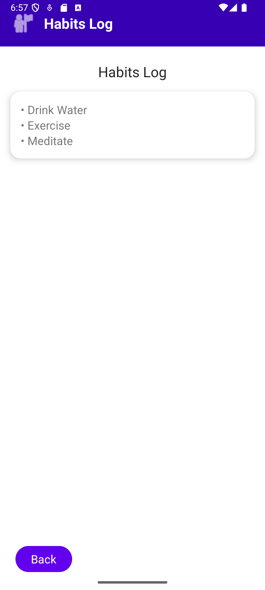

# DailyWell App

**DailyWell** is a wellness-focused Android app developed in Kotlin. It encourages users to build healthy habits, reflect on their progress, and provide feedback to improve the app experience.

---

## 📱 Features

- 🧘‍♀️ **Habits Tracker**: Log and review daily wellness habits.
- 💬 **Feedback Form**: Collect user suggestions and feedback with a clean Material Design form.
- 🧭 **Navigation**: Smooth transitions between activities using buttons.

---

## 🎨 UI Overview

The app follows modern Material 3 design patterns and includes:

- **Top header** with icon and title.
- **CardView form layout** for structured input.
- Buttons for **Submit**, **Reset**, and **Back** actions.

---

## 📸 Screenshots

| Feedback Form | Habits Log |
|---------------|-------------|
|  |  |

> All screenshots are located in the `/screenshots` directory for submission/documentation purposes.

---

## 🗂️ Folder Structure

DailyWell/
├── app/
│ └── src/
│ └── main/
│ └── res/
│ └── layout/
│ ├── activity_feedback.xml
│ └── activity_habits.xml
├── screenshots/
│ ├── feedback_form.png
│ └── habits_log.png
├── README.md
└── build.gradle

---

## 🔧 Tech Stack

- Language: **Kotlin**
- IDE: **Android Studio**
- UI: **XML Layouts**, **Material3 Components**
- Min SDK: `21`+
- Target SDK: `33`+

---

## ✅ How to Run

1. Clone the repository
2. Open in **Android Studio**
3. Sync Gradle and Run the app on an emulator or device

---

## ✍️ Author

- **Dhruv Jivani**
- Student Number: 9044406
- Course: Mobile and Web Development, Conestoga College
- Subject: Mobile Application Development I

---

